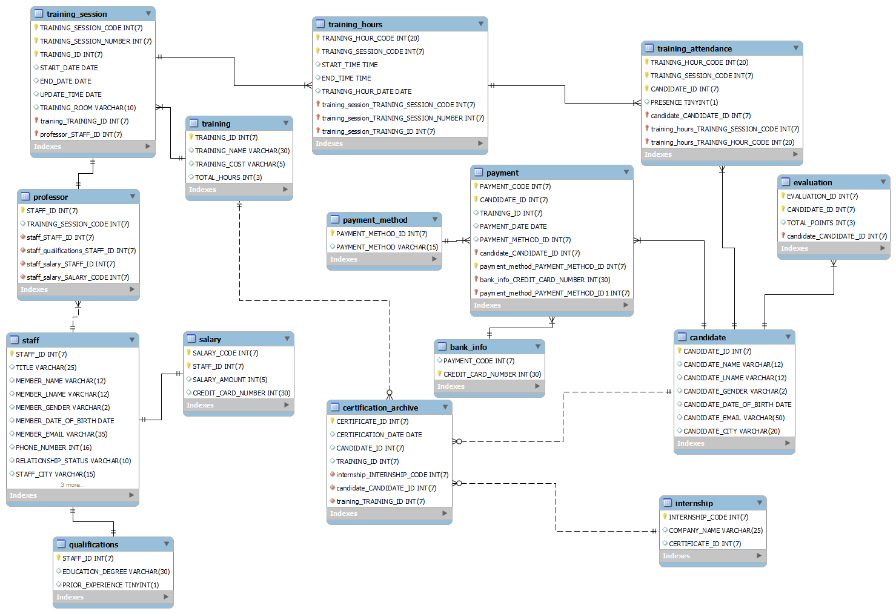
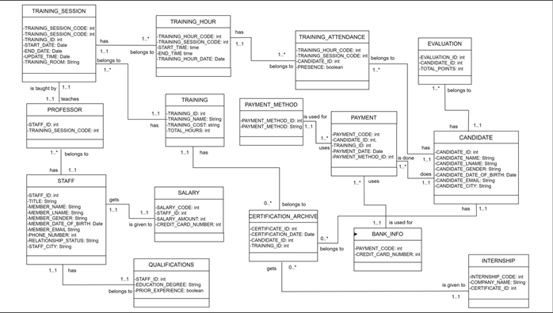
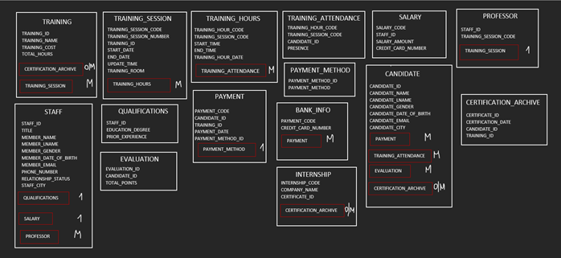

# Professional Training Center Database Project

### Project Title: Database Implementation for TC Professional Training Center

## Project Overview

This project involves creating a database for a company offering professional training in various fields, including IT programming and cybersecurity. The database is designed to manage and store information about trainings, candidates, professors, staff, and other related entities.

## Database Architecture

The database contains a total of 15 tables, including 6 strong entities and 9 weak entities.

### Strong Entities
- **TRAINING**
- **CANDIDATE**
- **PROFESSOR**
- **STAFF**
- **INTERNSHIP**
- **CERTIFICATION_ARCHIVE**

### Weak Entities
- **TRAINING_SESSION**
- **TRAINING_HOURS**
- **TRAINING_ATTENDANCE**
- **PAYMENT**
- **PAYMENT_METHOD**
- **BANK_INFO**
- **SALARY**
- **QUALIFICATIONS**
- **EVALUATION**

Each table has its attributes and primary keys. The relationships between the strong entities are weak, while the relationships between strong and weak entities are strong.

## Database Normalization

The database is normalized up to the third normal form (3NF) to ensure data integrity and minimize redundancy.

## Business Rules

- A training can have many training sessions.
- A training session belongs to only one training.
- A training session can have many training hours.
- A training hour belongs to only one session.
- A training hour can have many training attendance records.
- A training attendance record belongs to only one training hour.
- A candidate can have many training attendance records.
- A training attendance record belongs to only one candidate.
- A professor lectures a training session.
- A training session is lectured by one professor.
- A professor belongs to a staff.
- A staff contains many professors.
- A staff member has one salary.
- A salary is given to one staff member.
- A candidate makes many payments.
- A payment is made by one candidate.
- A payment method is used in many payments.
- A payment uses one payment method.
- A bank info is used to make many payments.
- A payment is made using one bank info.
- A staff member has one qualification.
- A qualification belongs to one staff member.
- A candidate can have many certificates.
- A certificate belongs to one candidate.
- A training can have many certificates.
- A certificate belongs to one training.
- An internship can be given to many certificates.
- A certificate can have one internship.
- A candidate can have many evaluations.
- An evaluation belongs to one candidate.

## ER Diagrams

### Crow’s Foot Notation ER Diagram

### UML Diagram

### Object-Oriented Diagram

---
